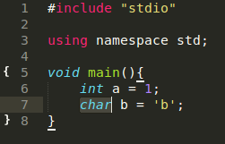
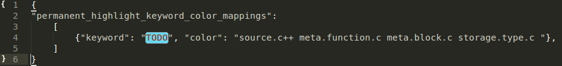

HighlightWords
==============

A Sublime Text 2 and 3 plugin for highlighting mutiple words in different colors

The following configuration options are available:
* Regular Expression
* Case Sensitive
* Customize Highlight Colors
* Define "Always Highlighted Keywords" with Customized Colors

Usage
------------------
* Highlight: Select "Edit > Highlight Words > Highlight Words" and enter the words (separated by whitespace)
* Unhighlight: Select "Edit > Highlight Words > Unhighlight Words"
* Toggle Settings: Select "Edit > Highlight Words > Toggle Settings"
* Edit settings file: Select "Preferences" > "Package Settings" > "HighlightWords", copy settings from default to user, and edit settings file. Available settings are:
 - "colors_by_scope": Change the highlight colors.
 - "permanent_highlight_keyword_color_mappings": Define always highlighted keywords with specified colors, such as "TODO" or "FIXIT". The optional "flag" parameter may be 0 (regex), 1 (literal), 2 (regex and ignore case) or 3 (literal and ignore case).
* Perl-style regular expression patterns are accepted. For example, to highlight "fix a bug" but not "prefix with", the expression could be "\\bfix .*\\b".

Note: These commands are also available in Command Panel with prefix "**HighlightWords:**"

How to find color scope
------------------
  * Open the file that has some colour you want (e.g open C++ which have green strings)
  * Select the word that has colour you want to use

  
  * Open console (ctrl+~ (tilde))
  * Paste `view.scope_name(view.sel()[0].begin())` and press `ENTER`
  * Copy returned string, for mine selection it is `source.c++ meta.function.c meta.block.c storage.type.c`
  * Paste this string inside color property:

  

  **Color will change after you re-enter the tab**

Contact me
------------------
Please visit me if you have any question or suggestion at: http://weibo.com/seanliang
